# Лаба 2 — Мониторинг сервиса: метрики, логи, трейсы

Стек наблюдаемости вокруг сервиса `api` в локальном кластере kind. Всё разворачивается через Helm.

| Сигнал | Кто собирает | Где хранится | Где смотрим |
|---|---|---|---|
| Метрики | Prometheus (скрейп `/metrics` по ServiceMonitor) | Prometheus | Grafana, дашборд RED |
| Логи | Grafana Alloy (DaemonSet, читает `/var/log/pods`) | Loki | Grafana Explore |
| Трейсы | OpenTelemetry SDK в сервисе → OTLP/HTTP | Jaeger (all-in-one, in-memory) | Jaeger UI, Grafana |
| Алерты | Prometheus (PrometheusRule) → Alertmanager | Alertmanager | Alertmanager UI, Karma, webhook |

```
                    ┌──────────── namespace shop ────────────┐
                    │  api  (/metrics, JSON-логи в stdout,   │
                    │        OTLP/HTTP → jaeger:4318)        │
                    └───┬──────────────┬──────────────┬──────┘
        scrape /metrics │   stdout →   │              │ OTLP/HTTP
                        │ /var/log/pods│              │
┌──────────── namespace monitoring ────┼──────────────┼───────────────────────┐
│  Prometheus ◄───────┘        Alloy (DaemonSet)      ▼                       │
│      │  rules                  │                 Jaeger all-in-one          │
│      ▼                         ▼                    ▲                       │
│  Alertmanager ──► webhook    Loki                   │                       │
│      ▲                         │                    │                       │
│    Karma          Grafana ◄────┴── Prometheus ──────┘ (trace_id → Jaeger)   │
└─────────────────────────────────────────────────────────────────────────────┘
```

**Порядок установки важен.** Сначала ставится `kube-prometheus-stack`, потому что он регистрирует CRD `ServiceMonitor` и `PrometheusRule`. Только потом ставится чарт `api`, который эти CRD использует.

## Часть 0 — Сервис `api`

Сервис на Python (FastAPI) со следующими эндпоинтами:

- `/health` — проверка живости;
- `/fail` — 500, спан помечается ошибкой;
- `/slow` — 1–3 с во вложенном спане `slow-op`;
- `/load?n=&c=&path=` — `n` запросов к самому себе;
- `/metrics` — RED-метрики:
  - `http_requests_total`;
  - `http_request_errors_total`;
  - гистограмма `http_request_duration_seconds`.

Логи пишутся в stdout в формате JSON с полями `trace_id`/`span_id`. Трейсы собираются через OpenTelemetry (автоинструментирование FastAPI и httpx, ручные спаны в `/slow` и `/fail`).

```bash
kind create cluster --name obs
docker build -t api:0.1.0 ./api                 # сборка образа
kind load docker-image api:0.1.0 --name obs     # импорт образа в containerd ноды kind
helm create charts/api                          # каркас чарта
```

**Почему нужен `kind load`.** Нода kind — это контейнер со своим containerd, и образов из локального Docker она не видит. Тег указан конкретный (`0.1.0`), а не `latest`. Для `latest` Kubernetes по умолчанию ставит `imagePullPolicy: Always` и пошёл бы за образом в Docker Hub.

Что поменял в `charts/api/values.yaml`:

- `image.repository: api`, `image.tag: 0.1.0`;
- `service.port: 8080`, порт Service назван `http` (на это имя ссылается ServiceMonitor);
- liveness- и readiness-пробы на `/health`.

```bash
helm upgrade --install api charts/api -n shop --create-namespace
kubectl -n shop port-forward svc/api 8080:8080
curl localhost:8080/fail; curl "localhost:8080/load?n=50"
kubectl -n shop logs deploy/api | tail          # JSON-строки с trace_id
```

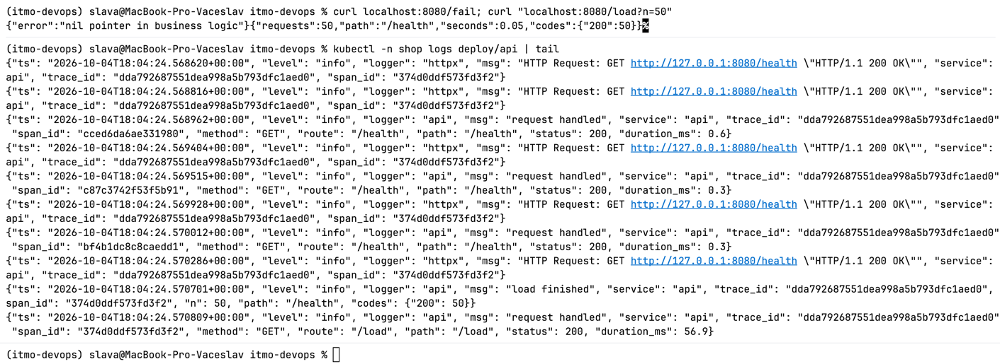

## Часть 1 — Метрики (Prometheus + Grafana)

### 1. Стек мониторинга

Ставлю `kube-prometheus-stack`. В него входят Prometheus Operator, Prometheus, Alertmanager, Grafana, node-exporter и kube-state-metrics.

Ключевое в `monitoring-values.yaml`:

- **Селекторы ServiceMonitor, PodMonitor и PrometheusRule.** Флаги `*SelectorNilUsesHelmValues: false`. Без них Prometheus выбирает только объекты с меткой `release: monitoring` и молча игнорирует ServiceMonitor и правила из чарта `api`.
- **Отключены `kubeControllerManager`, `kubeScheduler`, `kubeEtcd`, `kubeProxy`.** В kind эти компоненты слушают `127.0.0.1` внутри ноды и были бы вечно down.
- `scrapeInterval: 15s`.

```bash
helm repo add prometheus-community https://prometheus-community.github.io/helm-charts
helm repo update
helm upgrade --install monitoring prometheus-community/kube-prometheus-stack \
  -n monitoring --create-namespace -f monitoring-values.yaml
```

### 2. ServiceMonitor

Шаблон `charts/api/templates/serviceMonitor.yaml` включается флагом `serviceMonitor.enabled`. Он рендерится, только если CRD уже есть в кластере, это проверка `.Capabilities.APIVersions.Has`.

Как это работает:

- ServiceMonitor выбирает Service по `selectorLabels` чарта.
- Порт указывается по имени `http`.
- Оператор генерирует из него scrape-конфиг с `kubernetes_sd`.
- Service используется только для обнаружения. Prometheus берёт IP подов из EndpointSlice и скрейпит **каждый под напрямую**, минуя ClusterIP. Иначе счётчики разных реплик смешались бы в один ряд.

```bash
kubectl -n monitoring port-forward svc/monitoring-kube-prometheus-prometheus 9090
```

Проверка: Status → Target Health → `serviceMonitor/shop/api/0` в состоянии UP.

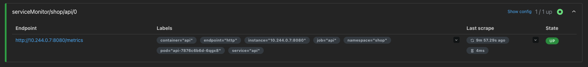

### 3. Дашборд RED в Grafana

Datasource Prometheus в Grafana провижится чартом автоматически.

```bash
kubectl -n monitoring get secret monitoring-grafana -o jsonpath='{.data.admin-password}' | base64 -d
kubectl -n monitoring port-forward svc/monitoring-grafana 3000:80
```

Создал RED (Rate, Errors, Duration) дашборд:
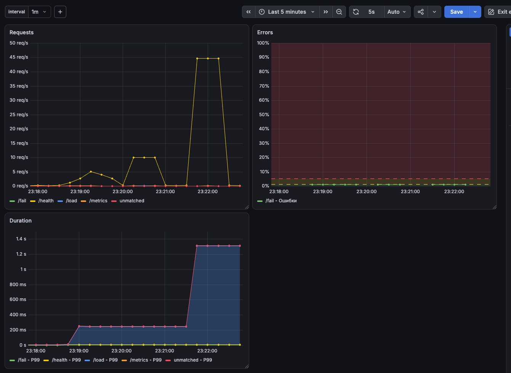

Дашборд экспортирован в JSON и сохранён в ConfigMap `dashboard-configmap.yaml` с меткой `grafana_dashboard: "1"`. Sidecar Grafana находит такие ConfigMap во всех namespace (`searchNamespace: ALL`) и загружает дашборд, поэтому он переживает пересоздание Grafana.

```bash
kubectl apply -f dashboard-configmap.yaml
```

## Часть 2 — Логи (Loki + Grafana)

### 1. Loki

Loki — это хранилище. Он индексирует **только метки**, а строки хранит сжатыми чанками без индекса по содержимому. Каждая уникальная комбинация меток образует отдельный стрим.

```bash
helm repo add grafana https://grafana.github.io/helm-charts
helm upgrade --install loki grafana/loki -n monitoring -f loki-values.yaml
```

### 2. Агент сбора: Grafana Alloy

Alloy развёрнут как DaemonSet, по одному поду на ноду. Пайплайн:

1. `discovery.kubernetes` находит поды своей ноды (фильтр `spec.nodeName` из env `NODE_NAME`).
2. `discovery.relabel` строит путь к файлам `/var/log/pods/<ns>_<pod>_<uid>/<container>/*.log` и назначает метки.
3. `loki.source.file` читает файлы через hostPath `/var/log` и запоминает смещения в positions-файле.
4. `loki.process` снимает CRI-обёртку (`stage.cri`).
5. `loki.write` отправляет строки в Loki.

Агент читает те же файлы, которые пишет containerd-shim и из которых kubelet отдаёт `kubectl logs`. Разница в том, что агент уносит их с ноды раньше, чем их удалит ротация (`containerLogMaxSize`/`containerLogMaxFiles`) или GC контейнеров.

Метками Loki сделаны только поля **с низкой кардинальностью**, потому что каждое их сочетание образует отдельный стрим:

```alloy
rule {
  source_labels = ["__meta_kubernetes_namespace"]
  target_label  = "namespace"
}
rule {
  source_labels = ["__meta_kubernetes_pod_name"]
  target_label  = "pod"
}
rule {
  source_labels = ["__meta_kubernetes_pod_container_name"]
  target_label  = "container"
}
rule {
  source_labels = ["__meta_kubernetes_pod_label_app_kubernetes_io_name"]
  target_label  = "app"
}
```

`trace_id`, `status`, `route` в метки **не выносятся**. С меткой `trace_id` каждый запрос порождал бы новый стрим, и индекс раздулся бы. Эти поля ищутся по содержимому строки, например `| json | level="error"`. Метка `pod` меняется при каждом деплое, но остаётся ограниченной и для стенда допустима.

```bash
helm upgrade --install alloy grafana/alloy -n monitoring -f alloy-values.yaml
```

### 3. Loki в Grafana

Loki подключён как datasource через `grafana.additionalDataSources` в `monitoring-values.yaml`:

```bash
helm upgrade --install monitoring prometheus-community/kube-prometheus-stack \
  -n monitoring -f monitoring-values.yaml
```

Поиск ошибки после `/fail`:

```logql
{namespace="shop", container="api"} | json | level="error"
```

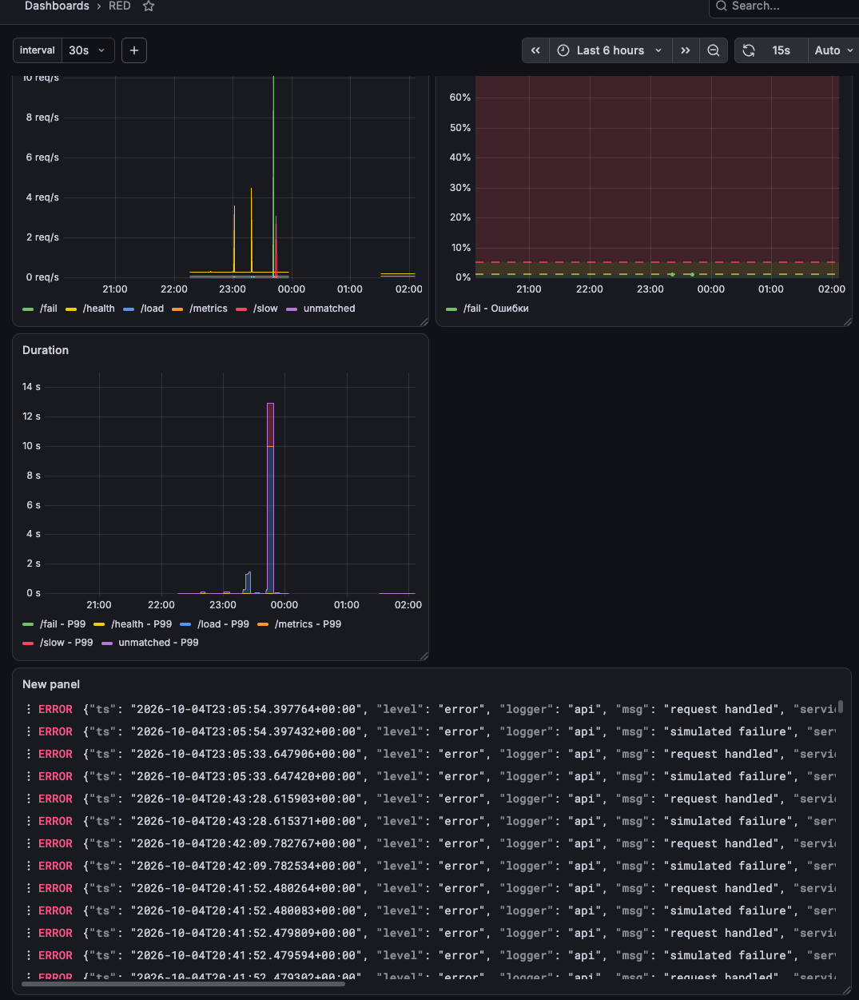

## Часть 3 — Трейсы (OpenTelemetry + Jaeger)

### 1. Jaeger

Режим all-in-one объединяет приём OTLP (4317 gRPC, 4318 HTTP), хранилище и UI в одном поде. Хранилище находится в памяти, поэтому при рестарте пода трейсы теряются. Для стенда это допустимо.

```bash
helm repo add jaegertracing https://jaegertracing.github.io/helm-charts
helm repo update
helm upgrade --install jaeger jaegertracing/jaeger -n monitoring -f jaeger-values.yaml
```

### 2. Направить сервис на Jaeger

В `charts/api/values.yaml` добавил переменную, а в `templates/deployment.yaml` пробросил `env` в контейнер:

```yaml
env:
  - name: OTEL_EXPORTER_OTLP_ENDPOINT
    value: "http://jaeger.monitoring:4318"
```

Порт 4318 выбран потому, что сервис экспортирует по OTLP/**HTTP**. Путь `/v1/traces` экспортёр добавляет сам.

Спаны копятся в `BatchSpanProcessor` и отправляются в фоне, так что недоступность Jaeger не влияет на латентность `api`. При переполнении очереди спаны отбрасываются. На SIGTERM `provider.shutdown()` досылает буфер.

```bash
kubectl -n monitoring port-forward svc/jaeger 16686:16686
```

### 3. Трейсы в Jaeger UI

- `/slow`: время ушло на вложенный спан `slow-op`.

  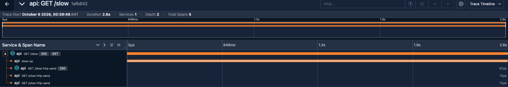

- `/fail`: корневой спан со `status=ERROR` подсвечен красным, в событиях записано исключение.

  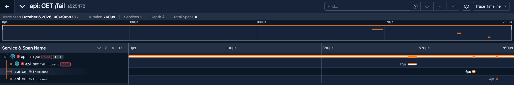

- `/load?n=20`: в **одном** трейсе собрались корневой спан `/load`, 20 клиентских спанов httpx и 20 серверных спанов `/health`.

  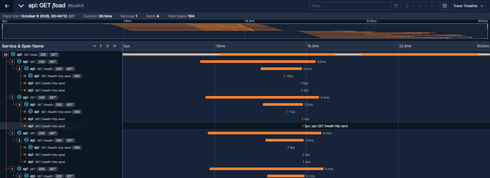

  Вложенные запросы — это отдельные HTTP-запросы. В один трейс их связывает W3C-заголовок `traceparent`: httpx-инструментирование вставляет его в исходящий запрос, а инструментирование FastAPI извлекает на входе. Без httpx-инструментирования это были бы 20 отдельных трейсов.

### 4. Связь логов и трейсов

Jaeger добавлен в Grafana как datasource. В datasource Loki настроен `jsonData.derivedFields`: регулярка извлекает `trace_id` из JSON-строки лога и превращает его во внутреннюю ссылку на datasource Jaeger. У каждой строки лога в Grafana появилось поле TraceId, по клику оно открывает водопад этого трейса.

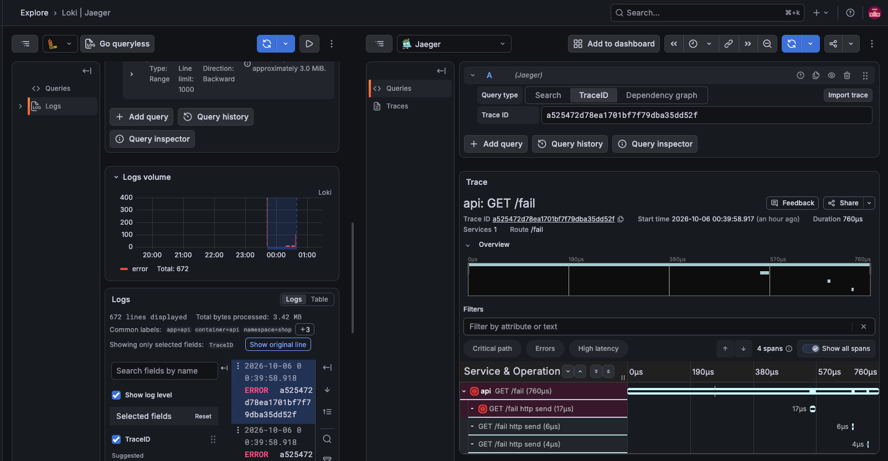

## Часть 4 — Алерты (Alertmanager + Karma)

Путь алерта:

1. Prometheus вычисляет правило раз в `evaluationInterval`.
2. Алерт проходит состояния inactive → pending (пока не истёк `for`) → firing.
3. Prometheus отправляет алерт в Alertmanager.
4. Alertmanager группирует, дедуплицирует и применяет silences и маршруты.
5. Уведомление уходит в receiver.

Prometheus решает, есть ли проблема. Alertmanager решает, кому, когда и сколько раз о ней сообщить.

### 1. Получатель

В `monitoring-values.yaml` (`alertmanager.config`) задан маршрут с группировкой по `alertname`, `namespace`, `severity` и receiver с `webhook_configs`. Группировка нужна, чтобы один инцидент не превращался в пачку отдельных уведомлений.

Приёмник — echo-сервер `webhook-receiver.yaml`, который печатает тело входящего запроса в stdout. Уведомления Alertmanager видны в его логах, а значит и в Loki.

```bash
kubectl apply -f webhook-receiver.yaml
helm upgrade --install monitoring prometheus-community/kube-prometheus-stack -n monitoring -f monitoring-values.yaml
kubectl -n monitoring logs -l app=webhook-receiver -f
```

#### Проблема: алерты доходили до Alertmanager, но не уходили получателю

Помогло явное указание секрета с конфигом:

```yaml
alertmanager:
  alertmanagerSpec:
    configSecret: alertmanager-monitoring-kube-prometheus-alertmanager
```

Механизм такой. Alertmanager читает не секрет, созданный Helm, а секрет `...-generated`. Его собирает оператор из базового секрета и объектов `AlertmanagerConfig`. После того как базовым секретом явно указан секрет с конфигом из values, маршрут и webhook-receiver попали в итоговый конфиг.

Проверить итоговый конфиг можно так:

```bash
kubectl -n monitoring get secret alertmanager-monitoring-kube-prometheus-alertmanager-generated \
  -o jsonpath='{.data.alertmanager\.yaml\.gz}' | base64 -d | gunzip
```

Конфиг также виден в Alertmanager UI на вкладке Status.

### 2. Правила алертов

Правила лежат в `charts/api/values.yaml` и рендерятся шаблоном `charts/api/templates/prometheusrule.yaml` через `toYaml`.

Сначала правила были записаны прямо в шаблон, и возникла проблема с экранированием. Причина в том, что аннотации Prometheus используют тот же синтаксис `{{ $value }}`, что и Helm, и Helm пытался вычислить их сам. Values не проходят через шаблонизатор, поэтому при выводе через `toYaml` выражения `{{ ... }}` доходят до Prometheus нетронутыми.

После `helm upgrade` оператор обновляет rule-файлы, а sidecar `config-reloader` сам перезагружает Prometheus. Рестарт не нужен, достаточно переоткрыть UI.

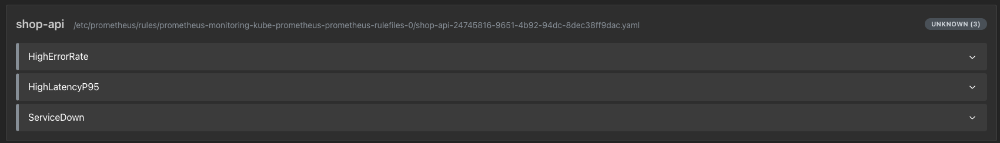


#### HighErrorRate — доля 5xx выше порога

```bash
sum by (route) (rate(http_request_errors_total{namespace="shop"}[5m])) / sum by (route) (rate(http_requests_total{namespace="shop"}[5m])) > 0.05 and sum by (route) (rate(http_requests_total{namespace="shop"}[5m])) > 1
```
Доля ошибок за окно `5m` больше `5%`, при этом интенсивность запросов больше `1 rps`; `for: 5m`.
- **Что ловит:** заметная часть пользователей получает ошибки.
- **Почему критично:** это прямой симптом, пользователь видит 5xx. Условие минимального трафика нужно, чтобы при слабом трафике единичная ошибка не давала 50% и алерт не флапал. Без трафика выражение равно NaN и не срабатывает, этот случай закрывает ServiceDown.
- **Что делать дежурному:**
  1. По дашборду RED найти, какие `route` дают ошибки и с какого момента.
  2. В Loki выполнить `{namespace="shop"} | json | level="error"`, посмотреть `reason`.
  3. По `trace_id` открыть трейс и понять, на каком шаге ошибка.
  4. Проверить, не было ли деплоя, и откатить при необходимости.

#### HighLatencyP95 — p95 времени ответа выше допустимого

```bash
histogram_quantile(0.95, sum by (le, route) (rate(http_request_duration_seconds_bucket{namespace="shop"}[5m]))) > 2
```
- **Что ловит:** больше `5%` запросов отвечают дольше порога в `2` секунды `for 5m`.
- **Почему критично:** сервис формально работает, но для пользователя медленно. Обычно это предвестник таймаутов и ошибок у клиентов. Порог выбран на границе бакета гистограммы.
- **Что делать дежурному:**
  1. Найти медленный `route` на дашборде.
  2. В Jaeger найти медленные трейсы и посмотреть, какой спан занимает время.
  3. Проверить насыщение: CPU и память пода, throttling, число реплик.

#### ServiceDown — сервис недоступен

```bash
(up{job="api",namespace="shop"} == 0) or (absent(up{job="api",namespace="shop"}))
```
Правило учитывает и `up == 0`, и **отсутствие** цели. При `replicas=0` ряд `up` исчезает, поэтому одного `up == 0` недостаточно: нужен `absent(...)` или kube-state-metrics; `for: 2m`.
- **Что ловит:** ни один под `api` не принимает запросы.
- **Почему критично:** полный отказ, пользователи не обслуживаются вообще.
- **Что делать дежурному:**
  1. `kubectl -n shop get deploy,pods` и `kubectl describe pod`, смотреть Events: `ImagePullBackOff`, `OOMKilled`, `FailedScheduling`.
  2. Проверить логи предыдущего запуска (`kubectl logs --previous`, Loki).
  3. Проверить последние изменения: деплой, масштабирование.

### 3. Проверка срабатываний

#### ServiceDown

```bash
kubectl -n shop scale deployment/api --replicas=0
```

Алерт переходит в pending:

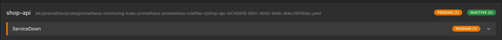

По истечении `for: 2m` условие всё ещё выполняется, и алерт переходит в firing:

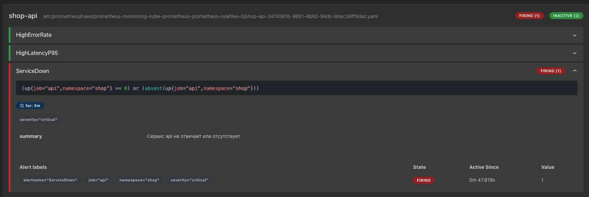

Alertmanager отправил webhook, он виден в логах приёмника:

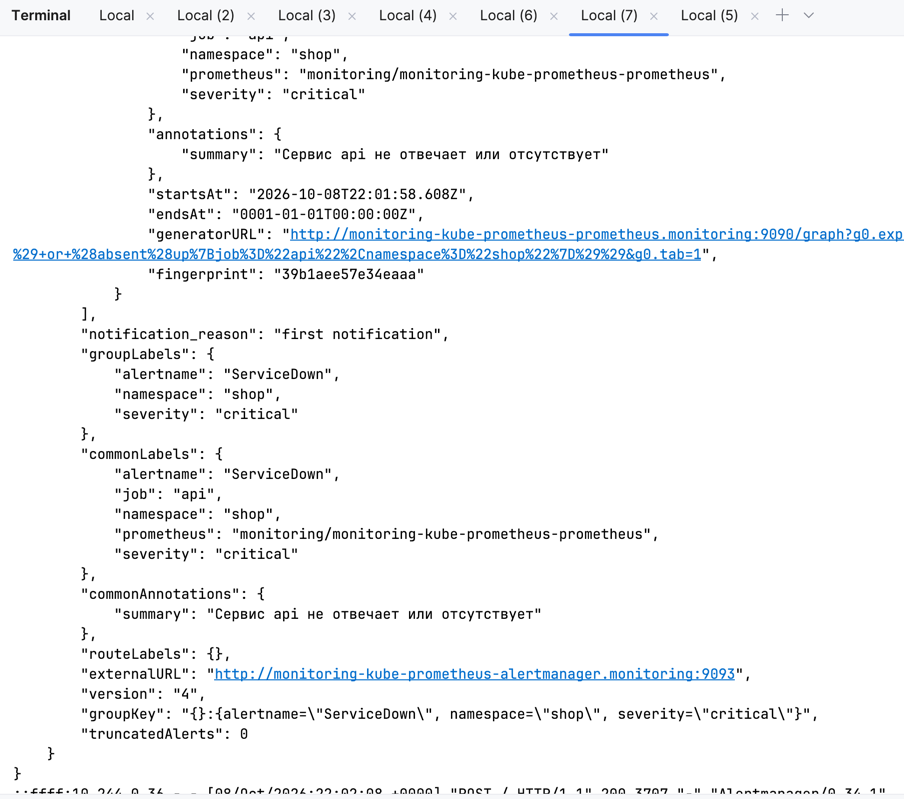

#### HighErrorRate и HighLatencyP95

Продолжительная нагрузка на `/slow`: около 5 rps примерно 200 с, каждый запрос длится 1–3 с. Это поднимает p95.

```bash
curl "localhost:8080/load?n=1000&c=10&path=/slow"
# {"requests":1000,"path":"/slow","seconds":203.29,"codes":{"200":1000}}
```

На этом фоне всплеск ошибок:

```bash
curl "localhost:8080/load?n=2000&c=100&path=/fail"
# {"requests":2000,"path":"/fail","seconds":2.55,"codes":{"500":2000}}
```

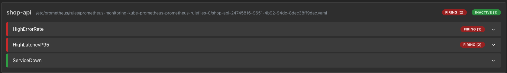

Webhook пришёл для обоих алертов.

**Наблюдение.** Всплеск ошибок длился всего 2,5 с, но HighErrorRate всё равно сработал. Причина в окне `rate(...)`: оно размазывает всплеск на всю свою длину. Пока 2000 ошибок остаются внутри окна, доля ошибок держится выше порога, и условие `for` успевает выполниться. То есть `for` защищает от коротких всплесков, только если он заметно длиннее окна `rate`. Это компромисс между скоростью реакции и ложными срабатываниями.

### 4. Karma

Karma — это stateless-дашборд поверх API v2 Alertmanager. Silence, созданный в Karma, на самом деле создаётся в Alertmanager. В `karma-values.yaml` задан `ALERTMANAGER_URI` (внутрикластерный адрес Alertmanager).

```bash
helm repo add wiremind https://wiremind.github.io/wiremind-helm-charts
helm repo update
helm upgrade --install karma wiremind/karma -n monitoring -f karma-values.yaml
kubectl -n monitoring port-forward svc/karma 8081:80    # 8080 уже занят port-forward к api
```

Алерты в Alertmanager:

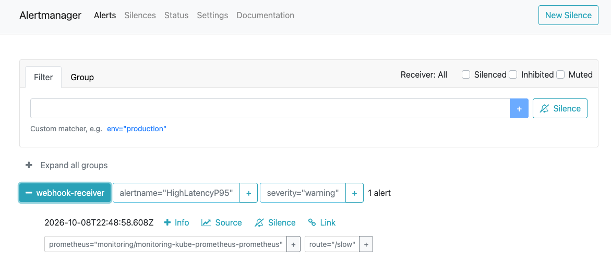

Те же алерты в Karma, сгруппированные:

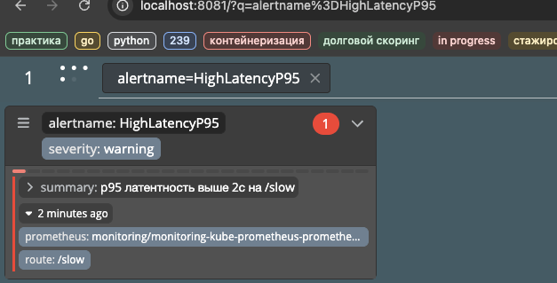

## Итог

Проверка связности стека:

- Нагрузка через `/load`, `/fail`, `/slow` отражается на дашборде RED.
- Ошибка находится в Loki через Grafana.
- По `trace_id` из строки лога открывается трейс в Jaeger, с медленным `slow-op` и красным спаном `/fail`.
- Три правила проходят pending → firing, уведомления доходят до webhook и видны в Alertmanager и Karma.

## Структура конфигурации

```
api/                          # сервис + Dockerfile
charts/api/                   # чарт сервиса: Deployment, Service, ServiceMonitor, PrometheusRule
monitoring-values.yaml        # kube-prometheus-stack: Prometheus, Alertmanager, Grafana (+ datasources Loki/Jaeger)
loki-values.yaml              # Loki SingleBinary
alloy-values.yaml             # Alloy DaemonSet, пайплайн сбора логов
jaeger-values.yaml            # Jaeger all-in-one
karma-values.yaml             # Karma
dashboard-configmap.yaml      # дашборд RED
webhook-receiver.yaml         # приёмник уведомлений
```
